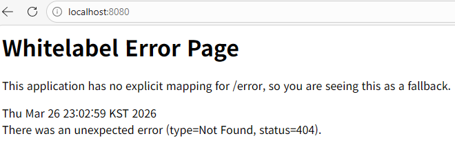

1주차에서 웹, http, api와 rest api를 공부했다.
웹은 인터넷 상에서 사용자들이 정보를 공유하는 장소로 클라이언트와 서버로 이루어져 있다.
클라이언트에서 request를 보내면 서버에서 response를 반환한다.

웹에는 주소가 있는데 이를 url (uniform resource locator)라 한다.
http://www.example.com:5883/category/food.html?topic=pizza&size=large 라는 url이 있으면
http 는 protocol로 통신하기 위한 규칙을 나타낸다.
www.example.com 부분이 host로 리소스가 위치한 서버의 ip 주소 혹은 도메인이 된다.
5883 은 포트 번호로 일반적으로 생략한다.
/category/food.html 은 path로 서버 내 리소스의 경로이고
?topic=pizza&size=large 는 query로 서버에 추가적인 정보를 보내는 파라미터인데 ? 뒤에 키-값 형식으로 쓴다.

http는 hypertext transper protocol로 무상태성과 비연결성의 특징을 가진다.

http 요청문은 start line, headers, body로 구성된다.
start line에 요청 메서드, 요청 경로, http 버전 정보가 포함되는데
http의 주요 메서드로 get, post, put, patch, delete가 있다.
get은 리소스 조회, post는 리소스 등록, put은 리소스 교체, patch는 리소스 일부 수정, delete는 리소스 삭제 메서드이다.

http 응답문은 status line headersm body로 구성된다.
status line에 http 버전, http 상태 코드, 상태 메시지가 포함되는데
http 주요 상태 코드로 200(OK), 201(Created), 400(Bad Request), 404(Not Found), 500(Internal Server Error)가 있다.

api는 application programming interface로 한 프로그램이 다른 프로그램의 기능이나 데이터를 사용할 수 있도록 미리 정해놓은 규칙이다.
rest는 representational state transfer로 http의 장점을 활용한 아키텍처로 uri, method, json 형식의 특징을 가진다.
rest api 는 rest 원칙을 준수해 만든 api이다.

- 상품 기능
1. 상품 정보 등록
HTTP Method: POST
URI: /products

2. 상품 목록 조회
HTTP Method: GET
URI: /products

3. 개별 상품 정보 상세 조회
HTTP Method: GET
URI: /products/{productId}

4. 상품 정보 수정
HTTP Method: PATCH
URI: /products/{productId}

5. 상품 삭제
HTTP Method: DELETE
URI: /products/{productId}

- 주문 기능
1. 주문 정보 생성
HTTP Method: POST
URI: /orders

2. 주문 목록 조회
HTTP Method: GET
URI: /orders

3. 개별 주문 정보 상세 조회
HTTP Method: GET
URI: /orders/{orderId}

4. 주문 취소
HTTP Method: PATCH
URI: /orders/{orderId}